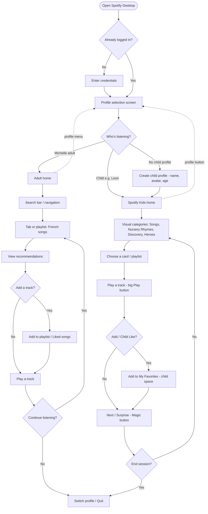

# Spotify User Flow - Flow Diagram

## Explanation of the User Flow

This user flow describes how Michelle interacts with Spotify on desktop, including both the adult experience and the child-friendly Spotify Kids experience.

### 1. Starting point
- The user opens the Spotify desktop app
- If already logged in, they go directly to the profile selection screen
- If not logged in, they must enter their credentials before reaching the profile selection screen

### 2. Profile selection
- The user chooses who is listening
- Michelle can select her adult profile to access the standard Spotify interface
- If a child, such as Léon, is using the app, they can select the Spotify Kids profile
- If no child profile exists, the parent can create one (by entering name, avatar, and age)

### 3. Adult flow (Michelle)
- From the home screen, Michelle can use the search bar or navigate through tabs
- She may open a playlist such as French songs
- From there, she can view recommendations and decide whether to add a track to her library (Liked Songs or playlists)
- Alternatively, she can play a track directly
- After listening, she decides whether to continue exploring or to quit/switch profile

### 4. Child flow (Spotify Kids)
- The Kids interface presents visual categories (Songs, Nursery Rhymes, Discovery, Heroes)
- The child selects a card or playlist
- Tracks can be played with a large, simple Play button
- Children may "like" songs with a dedicated child-friendly button, saving them into My Favorites
- They can also use the Magic button for a surprise song
- At the end of a session, they may quit or switch back to the profile selection screen

### 5. Quick profile switching
- At any time, both Michelle (adult flow) and a child (Kids flow) can return to the profile selection screen via the profile menu/button

⸻

👉 In summary, this flow highlights how Spotify can seamlessly support multi-profile use within a family context, giving Michelle access to her personalized adult experience while also providing a safe, playful, and simplified environment for children.